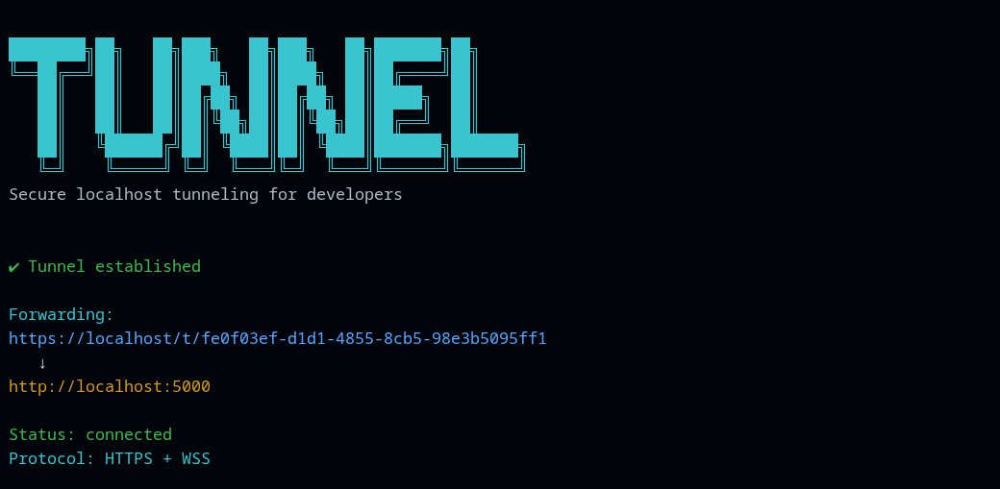
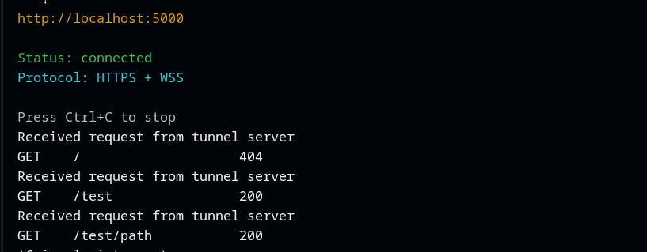

# Tunnel



Secure localhost tunneling built in Go using WebSockets.

Tunnel exposes your local HTTP server to the public internet through secure reverse tunnels — similar to ngrok.

Public hosted server:

https://tunnel.annuvrat.com

---

## Features

- Reverse HTTP tunneling
- HTTPS public forwarding
- Secure WebSocket transport (WSS)
- Concurrent request handling with goroutines
- Heartbeat monitoring
- Graceful shutdown handling
- Dockerized production deployment
- Automatic HTTPS with Caddy
- Cross-platform CLI binaries

---

## Architecture

```text
Browser
   ↓
Caddy HTTPS Reverse Proxy
   ↓
Tunnel Server
   ↓ WSS
Tunnel CLI
   ↓
localhost app
```

---

## Installation

### Linux / macOS

Download binary:

```bash
chmod +x tunnel

sudo mv tunnel /usr/local/bin/
```

Verify installation:

```bash
tunnel
```

---

### Windows

Run:

```bash
tunnel.exe http 5000
```

---

## Usage

Expose local port 5000:

```bash
tunnel http 5000
```

Example output:



```text
✔ Tunnel established

Forwarding:
https://tunnel.annuvrat.com/t/abc123
   ↓
http://localhost:5000

Status: connected
Protocol: HTTPS + WSS
```

---

## Example Tunnel URL

```text
https://tunnel.annuvrat.com/t/<tunnel-id>
```

---

## Tech Stack

- Go
- Gorilla WebSocket
- Cobra CLI
- Docker
- Caddy
- Google Cloud Platform (GCP)

---

## Infrastructure

- Dockerized multi-service deployment
- Automatic TLS provisioning with Caddy + Let's Encrypt
- Reverse proxy routing via subdomains
- Hosted on Google Cloud VM

---

## Future Improvements

- Custom subdomains
- Authentication
- Persistent tunnels
- Web dashboard
- Metrics & analytics
- Rate limiting
- Binary auto-updater

---

## Inspiration

Inspired by tools like:
- ngrok
- Cloudflare Tunnel
